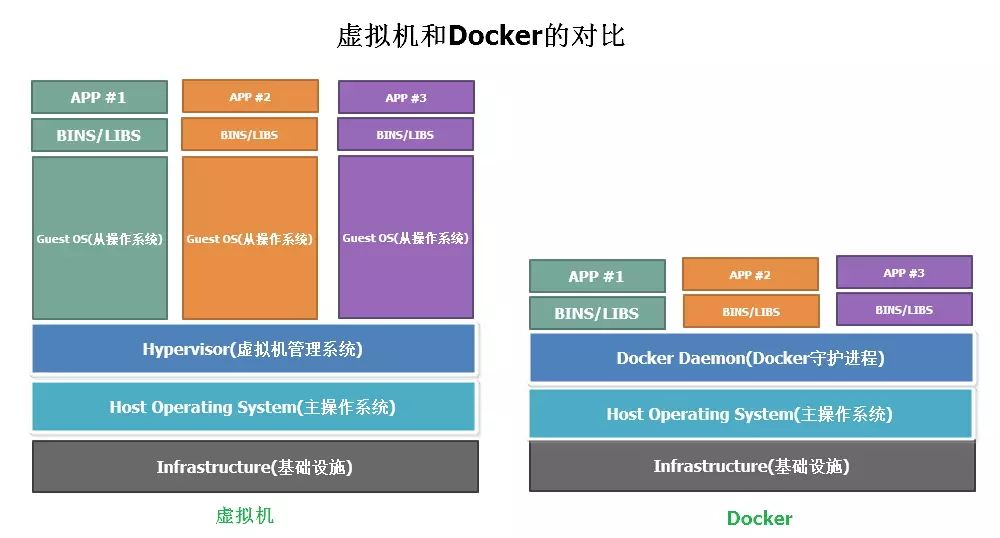
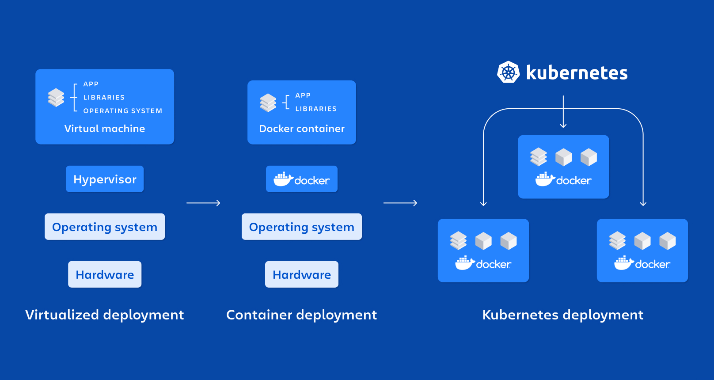
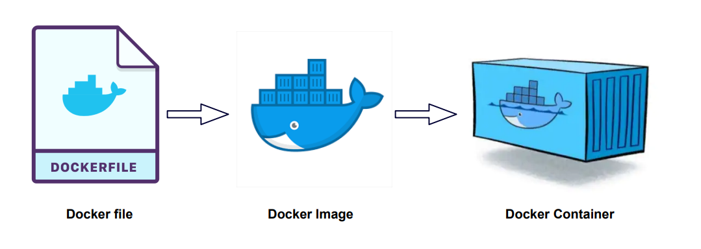
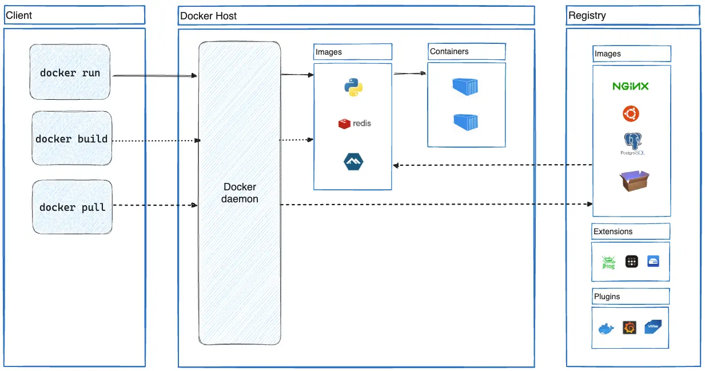
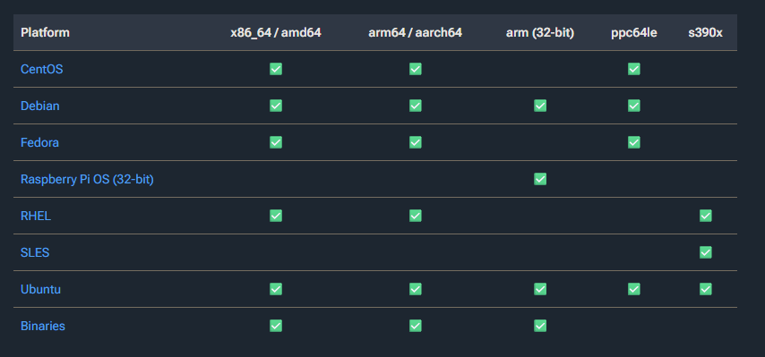
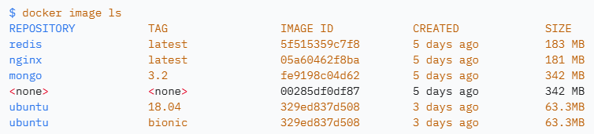
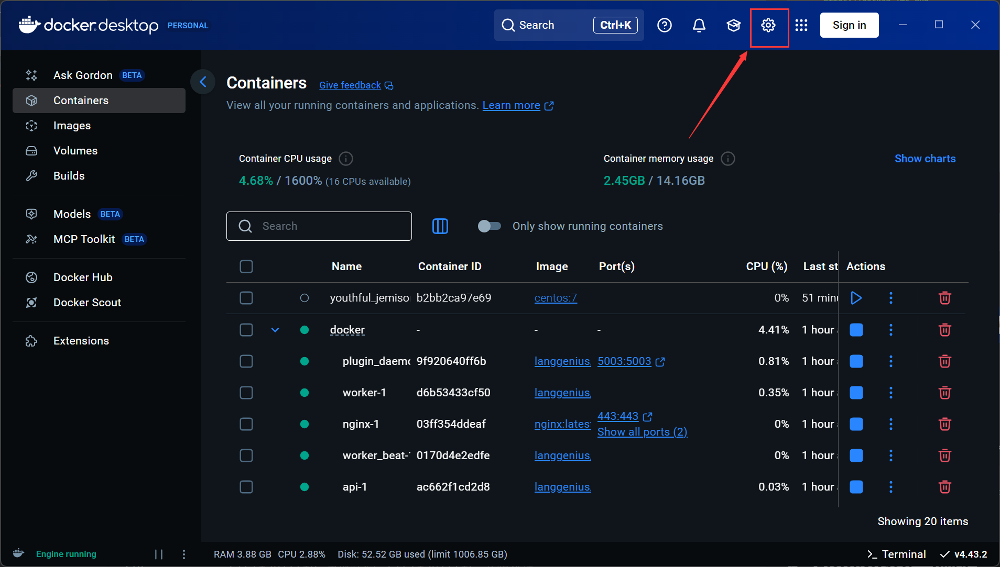
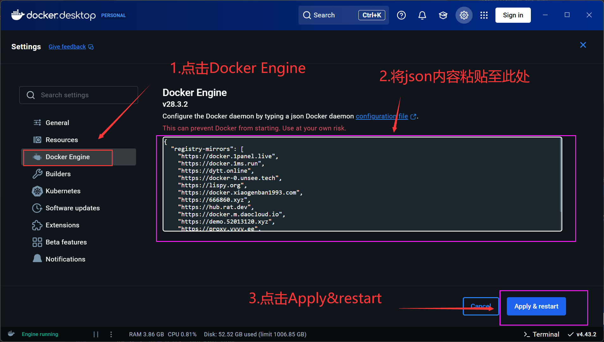
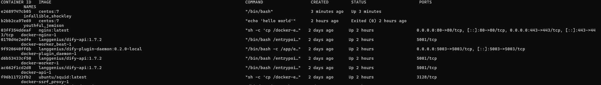
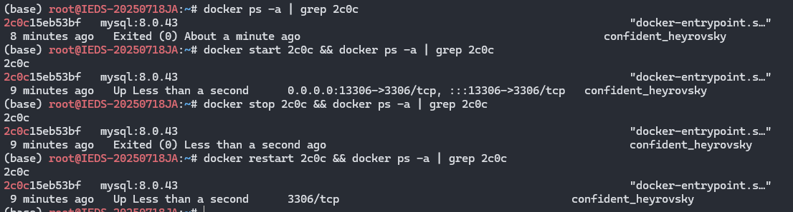

# 1. 应用及服务部署发展历程

## 1.1 传统物理机部署

**背景**: 

- 早期应用直接部署在物理服务器上。

**特点**: 

- 应用直接部署在物理服务器上, 一台服务器通常只运行一个应用或服务。
- 应用直接依赖物理硬件资源, 应用与硬件强绑定。

**问题**: 

- **环境依赖性强**: 应用依赖特定操作系统和底层环境依赖, 迁移或复制需要重新配置环境。
- **环境冲突**: 不同应用依赖的库版本不同, 很容易互相打架。
- **资源利用率低**: 一台服务器通常只部署单个服务, CPU和内存常常闲置。
- **扩展困难**: 横向扩展以及上线新应用必须买新服务器, 周期长、成本高。

## 1.2 虚拟化技术

**背景**: 

- 虚拟化（VM）技术普及（如 VMware、KVM、VirtualBox）。

**特点**: 

- 通过虚拟机技术在一台物理机上运行多个隔离的操作系统实例。
- 每个虚拟机包含完整的OS内核、虚拟硬件和应用环境。

**优势**: 

- **资源隔离**: 多个应用共享物理资源但互不干扰。
- **资源利用率提升**: 通过虚拟化层动态分配CPU、内存, 一台服务器可以部署多个应用和服务。

**局限性**: 

- **性能开销大**: 每个VM需运行完整OS, 占用额外计算资源。
- **启动速度慢**: VM启动需加载完整OS, 通常需要分钟级时间。
- **镜像庞大**: VM镜像包含OS内核, 通常为GB级别, 分发效率低。

## 1.3 容器化技术

**背景**: 

- Linux容器（LXC）等早期技术已实现进程级隔离, 但易用性和标准化不足。
- Docker通过镜像分层、标准化接口和工具链, 将容器技术推向主流。

**特点**: 

- 容器共享宿主机的操作系统内核, 只封装运行所需的依赖与环境
- 容器就像“宿舍房间”, 虽然共用一栋楼（操作系统）, 但每个人有独立小空间



**核心改进**: 

- **轻量级**: 容器共享主机OS内核, 无需虚拟化硬件, 性能损耗小, 资源占用极低（M级）。
- **环境一致性**: 镜像包含应用及其所有依赖, 实现“一次构建, 处处运行”。
- **维护和扩展友好**: Docker使用的分层存储以及镜像的技术, 使得应用重复部分的复用更为容易, 也使得应用的维护更新更加简单,
  基于基础镜像进一步扩展定制镜像也变得非常简单。

### 1.4 容器编排与集群

**背景**: 

- 单台服务器不足以支撑大规模应用, 需要容器集群管理(Kubernetes、Docker Swarm)

**特点**: 

- 自动化容器部署、扩缩容、负载均衡、健康检查
- 跨多台服务器调度容器, 形成一个大集群



**优势**: 

- **高可用**: 某个容器宕机, 会自动重启或迁移
- **弹性伸缩**: 根据流量自动增加/减少容器数量
- **大规模管理**: 上千容器集中管理

# 2. Docker的基本概念

* **镜像 (Image)**: 软件的“快照”, 就像“菜谱”
* **容器 (Container)**: 运行起来的应用, 就像“做好的菜”
* **仓库 (Registry)**: 放镜像的地方（类似“菜谱库” → GitHub for 镜像）

## 2.1 Docker 镜像

传统操作系统分为 **内核** 和 **用户空间**。

对于 `Linux` 而言, 内核启动后, 会挂载 `root` 文件系统为其提供用户空间支持。而 **Docker 镜像**（`Image`）, 就相当于是一个
`root` 文件系统。比如官方镜像 `ubuntu:18.04` 就包含了完整的一套 Ubuntu 18.04 最小系统的 `root` 文件系统。

**Docker 镜像** 是一个特殊的文件系统, 除了提供容器运行时所需的程序、库、资源、配置等文件外,
还包含了一些为运行时准备的一些配置参数（如匿名卷、环境变量、用户等）。镜像
**不包含** 任何动态数据, 其内容在构建之后也不会被改变。

> 因为镜像包含操作系统完整的 `root` 文件系统, 其体积往往是庞大的, 因此在 Docker
> 设计时, 就充分利用 [Union FS](https://en.wikipedia.org/wiki/Union_mount) 的技术, 将其设计为分层存储的架构。所以严格来说,
> 镜像并非是像一个
`ISO` 那样的打包文件, 镜像只是一个虚拟的概念, 其实际体现并非由一个文件组成, 而是由一组文件系统组成, 或者说, 由多层文件系统联合组成。

>
镜像构建时, 会一层层构建, 前一层是后一层的基础。每一层构建完就不会再发生改变, 后一层上的任何改变只发生在自己这一层。比如,
删除前一层文件的操作, 实际不是真的删除前一层的文件, 而是仅在当前层标记为该文件已删除。在最终容器运行的时候, 虽然不会看到这个文件,
但是实际上该文件会一直跟随镜像。因此, 在构建镜像的时候, 需要额外小心, 每一层尽量只包含该层需要添加的东西,
任何额外的东西应该在该层构建结束前清理掉。

> 分层存储的特征还使得镜像的复用、定制变的更为容易。甚至可以用之前构建好的镜像作为基础层, 然后进一步添加新的层,
> 以定制自己所需的内容, 构建新的镜像。

## 2.2 Docker 容器

镜像（`Image`）和容器（`Container`）的关系, 就像面向对象程序设计中的 `类` 和 `实例` 一样, 镜像是静态的定义, 容器是镜像运行时的实体,
一个镜像可以创建多个容器, 容器可以被创建、启动、停止、删除、暂停等。



容器不应该向其存储层内写入任何数据, 容器存储层要保持无状态化。所有的文件写入操作, 都应该使用 数据卷（Volume）、或者
绑定宿主目录, 在这些位置的读写会跳过容器存储层, 直接对宿主（或网络存储）发生读写, 其性能和稳定性更高。

数据卷的生存周期独立于容器, 容器消亡, 数据卷不会消亡。因此, 使用数据卷后, 容器删除或者重新运行之后, 数据却不会丢失。

>
容器的实质是进程, 但与直接在宿主执行的进程不同,
容器进程运行于属于自己的独立的 [命名空间](https://en.wikipedia.org/wiki/Linux_namespaces)
。因此容器可以拥有自己的 `root` 文件系统、自己的网络配置、自己的进程空间, 甚至自己的用户 ID
空间。容器内的进程是运行在一个隔离的环境里, 使用起来, 就好像是在一个独立于宿主的系统下操作一样。这种特性使得容器封装的应用比直接在宿主运行更加安全。也因为这种隔离的特性,
很多人初学
Docker 时常常会混淆容器和虚拟机。

> 容器同样使用分层存储。每一个容器运行时, 是以镜像为基础层, 在其上创建一个当前容器的存储层, 我们可以称这个为容器运行时读写而准备的存储层为
**容器存储层**。容器存储层的生存周期和容器一样, 容器消亡时, 容器存储层也随之消亡。因此, 任何保存于容器存储层的信息都会随容器删除而丢失。

## 2.3 Docker 仓库

镜像构建完成后, 可以很容易的在当前宿主机上运行, 但是, 如果需要在其它服务器上使用这个镜像, 就需要一个集中的存储、分发镜像的服务,
即Docker仓库,
可以类比npm和maven的依赖仓库。

同一个软件有不同的版本, 在Docker仓库中, 同一个镜像也包含不同版本, 镜像的不同版本使用标签（tag）进行标记区分, 格式为
`<镜像名>:<标签名>`, 如果不指定标签, 将以 `latest` 作为默认标签。

以[Mysql镜像](https://hub.docker.com/_/mysql) 为例, 镜像名为`mysql`, 在仓库中包含多个版本, 即多个tag, 如`8.0.43-debian`,
`5.7.44-oraclelinux7`, 可以通过`mysql:8.0.43-debian`或者`mysql:5.7.44-oraclelinux7`指定使用的镜像版本, 如果不指定任何标签,
即:`mysql`, 将视为`mysql:latest`

## 2.4 整体工作架构



# 3. 环境准备与安装

## 3.1 DockerEngine安装

Docker Engine 是 Docker 的核心运行时引擎, 负责创建、运行和管理容器, 当前支持主流的linux发行版

### Ubuntu

在 Ubuntu LTS 版本上, 目前 Docker 支持 amd64、arm64、armhf、ppc64el、s390x 等 5 个平台；而非 LTS 版本支持的平台通常较少。

```shell
# 下载官方安装脚本 (无需代理)
curl -fsSL get.docker.com -o get-docker.sh
# 执行脚本, 并使用aliyun源安装依赖
sudo sh get-docker.sh --mirror Aliyun
# 启动docker
systemctl enable docker
systemctl start docker
# 测试安装 
docker run --rm docker.1ms.run/library/hello-world
```

其他官方已验证linux发行版都可以使用该方式进行安装

官方已验证linux发行版支持情况如下:



详情可参考官方文档: https://docs.docker.com/engine/install/

### Centos7

Docker官方已逐步放弃支持CentOS7和Centos8, 可通过如下步骤安装

```shell
# 卸载旧版本
yum remove docker docker-client docker-client-latest docker-common docker-latest docker-latest-logrotate docker-logrotate docker-selinux docker-engine-selinux docker-engine
# 安装docker依赖
yum -y install yum-utils device-mapper-persistent-data lvm2
# 指定 Docker 镜像源, 使用阿里云加速
yum-config-manager --add-repo http://mirrors.aliyun.com/docker-ce/linux/centos/docker-ce.repo
# 安装docker-ce
yum -y install docker-ce docker-ce-cli containerd.io
# 启动docker
systemctl enable docker
systemctl start docker
# 测试安装 
docker run --rm docker.1ms.run/library/hello-world
```

## 3.2 Docker Desktop安装

在 macOS 和 Windows 上, 无法直接安装 Docker Engine 的原生二进制版

可以通过Docker Desktop来运行Docker, 它会自动在后台创建一个 Linux 虚拟机（macOS 利用 HyperKit, Windows 利用 WSL 2
或HyperV）来运行 Docker Engine 的守护进程

### windows

下载Docker Desktop for Windows:
https://desktop.docker.com/win/main/amd64/Docker%20Desktop%20Installer.exe

使用HyperV基底
参考: https://www.runoob.com/docker/windows-docker-install.html

使用wsl2基底
参考: https://learn.microsoft.com/zh-cn/windows/wsl/tutorials/wsl-containers

### macOS

下载Docker Desktop for Mac:
https://desktop.docker.com/mac/main/amd64/Docker.dmg

双击下载的 .dmg 文件, 然后将Docker图标拖拽到 Application 文件夹即可

或者使用 Homebrew Cask 来进行安装: `brew install --cask docker`

# 4. Docker镜像操作

## 4.1 拉取镜像: `docker pull`

#### 完整命令:

```shell
docker pull [选项] [Docker远程仓库地址[:端口号]/]镜像名[:标签]
```

#### 示例:

```shell
# 从官方仓库拉取mysql:8.0.43镜像
docker pull mysql:8.0.43
# 从公司docker仓库拉取ieds-maven:3.9-amazoncorretto-17-alpine镜像
docker pull 10.10.63.97:8083/ieds-maven:3.9-amazoncorretto-17-alpine
```

## 4.2 查看镜像: `docker images`

#### 输出结果如下:



包含了`镜像名(REPOSITORY)`、`标签`、`镜像 ID`、`创建时间` 以及 `所占用的空间`。

## 4.3 镜像设置标签: `docker tag`

可以使用 docker tag 命令, 为镜像添加一个新的标签。

#### 示例:

```shell
# 为镜像`mysql:8.0.43`添加标签`mysql:8.0.43-test1`:
docker tag mysql:8.0.43 mysql:8.0.43-test1
# 也可以铜鼓过镜像ID添加标签
docker tag 304929b30183 mysql:8.0.43-test1
```

## 4.4 删除镜像: `docker rmi`

#### 完整命令:

```shell
docker image rm [选项] <镜像1> [<镜像2> ...]
```

镜像名可使用`镜像名:标签`的形式, 也可以使用`镜像 ID`的形式

#### 示例:

```shell
# 通过镜像名删除mysql:8.0.43镜像
docker rmi mysql:8.0.43
# 通过镜像ID删除镜像
docker rmi 05a60462f8ba
```

## 4.5 镜像的保存与读取: `docker save -o` / `docker load -i`

这对命令用于将**一个或多个镜像**及其所有元数据完整地打包或解包, 实现镜像的离线备份和迁移。

### `docker save -o ` - 保存镜像到文件

将一个或多个镜像打包输出到一个 tar 归档文件。

#### 完整命令:

```shell
docker save -o tar文件名 镜像名[:标签] [镜像名[:标签] ...]
```

#### 示例:

```shell
# 将单个镜像 mysql:8.0.43 保存为 tar 文件
docker save -o mysql_8.0.43.tar mysql:8.0.43

# 将多个镜像打包到一个文件中
docker save -o my_images.tar mysql:8.0.43 nginx:alpine

# 使用重定向操作符（效果同上）
docker save mysql:8.0.43 > mysql_8.0.43.tar
```

### `docker load -i` - 从文件读取镜像

从一个由 `docker save` 创建的 tar 归档文件中载入镜像及元数据。

#### 完整命令:

```shell
docker load -i tar文件名
```

#### 示例:

```shell
# 从文件载入镜像
docker load -i mysql_8.0.43.tar

# 使用重定向操作符（效果同上）
docker load < mysql_8.0.43.tar
```

# 5. Docker仓库操作

## 5.1 本地镜像仓库配置

Docker官方提供了公共镜像仓库Docker Hub, 但国内访问Docker Hub受限, 需要通过代理访问,
如有条件可以访问 https://hub.docker.com 详细了解

未配置镜像源的前提下, 可以通过命令:`docker run --rm hello-world`测试能否从官方仓库拉取到镜像

考虑到日常工作环境, Docker仓库可以配置使用公开的镜像源或者公司私服仓库

### 配置镜像源:

安装docker后, 通过以下步骤配置镜像源:

#### linux版docker-ce:

1. 查看镜像源配置文件是否存在, 如果文件不存在则新建: `cat /etc/docker/daemon.json`
2. 编辑`/etc/docker/daemon.json`文件
3. 在文件中添加如下内容:

```json
{
  "registry-mirrors": [
    "https://docker.1panel.live",
    "https://docker.1ms.run",
    "https://dytt.online",
    "https://docker-0.unsee.tech",
    "https://lispy.org",
    "https://docker.xiaogenban1993.com",
    "https://666860.xyz",
    "https://hub.rat.dev",
    "https://docker.m.daocloud.io",
    "https://demo.52013120.xyz",
    "https://proxy.vvvv.ee",
    "https://registry.cyou"
  ]
}
```

4. 重启docker服务

```shell
systemctl restart docker
```

5. 验证镜像源是否生效: `docker run --rm hello-world`

#### windows/macOS版docker-desktop:

1. 启动docker desktop, 点击右上角`Settings`按钮(齿轮状)
   

2. 点击`Docker Engine`选项卡, 并在右侧粘贴以下配置:

```json
{
  "registry-mirrors": [
    "https://docker.1panel.live",
    "https://docker.1ms.run",
    "https://dytt.online",
    "https://docker-0.unsee.tech",
    "https://lispy.org",
    "https://docker.xiaogenban1993.com",
    "https://666860.xyz",
    "https://hub.rat.dev",
    "https://docker.m.daocloud.io",
    "https://demo.52013120.xyz",
    "https://proxy.vvvv.ee",
    "https://registry.cyou"
  ]
}
```

3. 点击`Apply & Restart`按钮, 重启docker desktop
   

4. 验证镜像源是否生效: `docker run --rm hello-world`

更多有关开放镜像源的使用和配置信息, 可参考以下资料或自行搜索`docker镜像源`相关文章:

https://github.com/dongyubin/DockerHub

https://www.wangdu.site/course/2109.html

## 5.2 docker指定镜像仓库拉取镜像

以上所有的镜像源配置后都可以直接使用`docker pull`命令拉取镜像, 如`docker pull centos:7`

也可以直接指定镜像仓库拉取镜像, 如`docker pull docker.1ms.run/centos:7`

通过这种方式可以直接拉取公司私服的镜像, 如`docker pull 10.10.63.97:8083/centos:7`

### 公司Docker仓库私服地址

`10.10.63.97:8083`

> 理论上也可以将公司docker私服地址直接配置到镜像源中, 但考虑到公司docker私服无法代理官方仓库, 配置意义不大

### 避免Docker安全性提醒

insecure-registries配置用于配置Docker中用来临时绕过TLS认证证书认证的参数, 用于解决拉取镜像时提示不安全的问题

daemon.json添加该段配置, 参照上文配置镜像源的步骤进行配置

```json
  "insecure-registries": [
"10.10.63.97:8082",
"10.10.63.97:8083"
]

```

> 注意JSON格式, 不要漏了逗号, 或者{}范围错误, `daemon.json`配置错误会导致docker服务无法启动

最终配置可能如下:

```json
{
  "registry-mirrors": [
    "https://docker.1panel.live",
    "https://docker.1ms.run",
    "https://dytt.online",
    "https://docker-0.unsee.tech",
    "https://lispy.org",
    "https://docker.xiaogenban1993.com",
    "https://666860.xyz",
    "https://hub.rat.dev",
    "https://docker.m.daocloud.io",
    "https://demo.52013120.xyz",
    "https://proxy.vvvv.ee",
    "https://registry.cyou"
  ],
  "insecure-registries": [
    "10.10.63.97:8082",
    "10.10.63.97:8083"
  ]
}
```

### 公司Docker仓库私服Nexus管理地址:

`http://10.10.63.97:8081`
账号密码同maven私服账号密码一致

## 5.3 推送镜像至私服

登录镜像仓库, 可以将本地镜像推送至远程仓库

#### 步骤:

1. 使用`docker login`命令登录镜像仓库
2. 使用`docker tag`命令为本地镜像添加远程仓库标签
3. 使用`docker push`命令推送镜像至远程仓库

#### 示例:

```shell
# 使用账号ieds_developer登录到私服10.10.63.97:8083
docker login -u ieds_developer 10.10.63.97:8083
# 输入密码后显示Login Succeeded
# 为本地镜像添加远程仓库标签
docker tag centos:7 10.10.63.97:8083/centos:7
# 推送镜像至远程仓库
docker push 10.10.63.97:8083/centos:7
```

# 6. Docker容器操作

## 6.1 创建容器: `docker run`

**常用参数**:

- -i : 交互式操作
- -t : 终端
- -d : 后台运行
- -p : 指定端口映射
- -v : 绑定挂载卷(目录映射)
- -e : 设置环境变量
- --rm : 容器退出后随之删除
- --name : 指定容器名称
- --restart : 重启策略
- --network : 指定网络模式

### 示例

以下通过多个示例来演示`docker run`命令的常见使用方式。

#### 示例1:

启动一个centos7容器, 并在容器内执行`echo 'hello world'` 命令后退出删除容器

```shell
docker run --rm centos:7 echo 'hello world'
```

#### 示例2:

启动一个centos7容器, 并进入交互式终端

```shell
docker run -it centos:7 /bin/bash
```

#### 示例3:

启动一个mysql容器, 后台运行, 并设置密码为123456, 端口映射至宿主机的13306端口

```shell
docker run -d -p 13306:3306 -e MYSQL_ROOT_PASSWORD=123456 mysql:8.0.43
```

#### 示例4:

启动一个git容器, 拉取代码到`D:\docker\git`目录后退出删除容器

```shell
docker run --rm -it -v D:\docker\git:/git alpine/git:2.49.1 clone http://10.10.64.98/chenweiguang/docker-guide.git
```

## 6.2 查看容器: `docker ps`

可以查看正在运行的容器, 也可以查看所有容器, 包含已停止的容器

#### 常用参数:

- -a : 显示所有容器, 包含已停止的容器

#### 输出结果如下:



## 6.3 停止/启动/重启容器: `docker stop/start/restart`

手动控制容器的运行状态



## 6.4 访问容器: `docker exec`

#### 常用参数:

- -it `docker exec`命令通过`-it`参数进入一个交互式终端

更多参数说明请使用 `docker exec --help` 查看。

#### 完整命令:

```shell
docker exec [选项] <容器标识> <要在容器内执行的命令> [命令参数...]
```

#### 示例1:

通常直接进入容器终端可以使用以下几种方式

```shell
docker exec -it 7afb6266b914 sh
docker exec -it 7afb6266b914 bash
docker exec -it 7afb6266b914 /bin/sh
docker exec -it 7afb6266b914 /bin/bash
```

#### 示例2:

不需要进入容器, 只想快速查看某个文件或执行一个简单命令。

```shell
# 查看容器内的 /app 目录内容
docker exec my_web_container ls /app

# 查看容器内 Nginx 的配置文件
docker exec my_nginx_container cat /etc/nginx/nginx.conf

# 以 www-data 用户的身份在容器内创建一个文件
docker exec -u www-data my_php_container touch /tmp/test.log
```

## 6.5 删除容器: `docker rm`

#### 常用参数:

- -f : 强制删除正在运行的容器, Docker 会发送 `SIGKILL` 信号给容器

## 6.6 查看容器日志: `docker logs`

容器通常会将应用程序的标准输出（STDOUT）和标准错误（STDERR）作为其日志。`docker logs` 命令用于查看这些日志,
是排查容器内应用运行问题的主要工具。

#### 常用参数:

- `-f` 或 `--follow`: **实时跟踪**日志输出, 类似于 `tail -f` 命令的效果。
- `--tail <数字>`: 仅显示最后指定行数的日志。例如 `--tail 50` 显示最后50行。
- `-t` 或 `--timestamps`: 在每条日志前显示**时间戳**。

#### 示例:

```shell
# 查看容器最近的全部日志
docker logs my_container

# 实时跟踪日志输出（常用于监控和调试）
docker logs -f my_container

# 查看最后20条日志, 并实时跟踪
docker logs --tail 20 -f my_container
```

## 6.7 查看容器详细信息: `docker inspect`

`docker inspect` 命令可以获取容器底层详细信息, 以 JSON 格式返回全部配置和状态数据。可以获取容器IP地址、检查挂载点、查看确切配置。

#### 常用参数:

- `-f` 或 `--format`: 使用 **Go 模板**来提取和格式化指定的信息, 而不是输出整个庞大的 JSON 对象。

#### 示例:

```shell
# 获取容器的所有信息（JSON格式）
docker inspect 7afb6266b914
# 获取容器的IP地址
docker inspect -f '{{range.NetworkSettings.Networks}}{{.IPAddress}}{{end}}' 7afb6266b914
```

## 6.8 导入与导出容器快照: `docker export` 和 `docker import`

这对命令用于将容器的**文件系统**打包成一个 tar 归档文件, 并在不同系统间迁移, **多用于调试和备份场景**。

`export/import` 操作的是**容器的当前文件系统快照**, 会丢失所有的历史记录、元数据（如环境变量、入口点、卷信息等）。

### `docker export` - 导出容器文件系统

将当前容器的文件系统快照导出为一个 tar 文件。

#### 常用参数:

- `-o` 或 `--output`: 将导出的内容写入指定文件, 而不是默认输出到 STDOUT。

#### 示例:

```shell
# 将容器快照导出为tar文件
docker export my_container -o my_container_snapshot.tar
```

### `docker import` - 导入容器快照为镜像

将一个由 `docker export` 创建的 tar 文件导入, 从而**创建一个新的镜像**。可以为新镜像指定名称和标签。

#### 命令格式:

```shell
docker import [选项] <文件|URL> [镜像名[:标签]]
```

#### 示例:

```shell
# 从tar文件导入并创建为一个新镜像
docker import my_container_snapshot.tar my-new-image:snapshot

# 从URL导入
docker import http://example.com/exampleimage.tgz example/imagerepo
```

### `export/import`和 `save/load`的区别

- **`docker export`**: 导出一个**容器**的**当前文件系统**（扁平化, 无历史层）。
- **`docker import`**: 从归档文件创建一个**镜像**。
- **`docker save`**: 导出一个或多个**镜像**（包含所有历史层和元数据）。
- **`docker load`**: 导入一个由 `save` 导出的镜像包（包含所有历史层和元数据）。

需要迁移或备份一个容器的当前状态时, 使用 `export/import`。

需要完整地备份或迁移一个镜像（保留其构建历史和层结构）时, 使用 `save/load`。

## 7. Dockerfile与自定义镜像

通过镜像可以很方便地创建出容器, 但是有写场景下从仓库拉取的镜像并不能满足我们的需求:

- 需要部署的是自己写的应用, 但实际镜像只能提供应用的运行环境, 而应用需要编译或构建才能运行
- 软件镜像可以安装插件或者扩展, 但是厂家不会提供这些插件, 需要自己额外安装

这种场景下需要定制镜像来满足需求, `Dockerfile` 就是用来构建镜像的文本文件, 其内容包含了若干条构建镜像所需的指令和说明。

## 7.1 Dockerfile指令

| 指令               | 作用                                              | 示例                                       |
|:-----------------|:------------------------------------------------|:-----------------------------------------|
| **`FROM`**       | **指定基础镜像**, 必须是第一条指令。                           | `FROM centos:7`                          |
| **`WORKDIR`**    | 设置后续指令的**工作目录**（如果不存在则创建）。                      | `WORKDIR /app`                           |
| **`COPY`**       | 将**构建上下文**中的文件或目录复制到镜像内。                        | `COPY . .`                               |
| **`ADD`**        | 类似 `COPY`, 但源可以是 URL, 且如果是 tar 文件会自动解压。         | `ADD app.tar.gz /app/`                   |
| **`RUN`**        | 在**构建过程中**执行命令, 常用于安装软件包。                       | `RUN apt update && apt install -y nginx` |
| **`EXPOSE`**     | **声明**容器运行时监听的端口（只是一个说明, 实际映射需用 `-p`）。          | `EXPOSE 80`                              |
| **`ENV`**        | 设置容器内的**环境变量**, 后续指令和容器运行时都可使用。                 | `ENV APP_PORT=8080`                      |
| **`CMD`**        | 指定容器**启动时**默认执行的命令。一个 Dockerfile 只能有一条 `CMD`。   | `CMD ["nginx", "-g", "daemon off;"]`     |
| **`ENTRYPOINT`** | 类似 `CMD`, 但不会被 `docker run` 后的参数覆盖, 通常用于设定固定入口。 | `ENTRYPOINT ["java", "-jar"]`            |

## 7.2 构建镜像: `docker build`

使用 `docker build` 命令, 根据 Dockerfile 的指令构建镜像。

#### 完整命令:

```shell
docker build [选项] <构建上下文路径>
```

#### 常用选项:

- `-t, --tag`: 为构建的镜像设置名称和标签, 格式为 `镜像名:标签`。
- `-f, --file`: 指定 Dockerfile 的路径（如果文件名不是 `Dockerfile`）。

#### 示例:

```shell
# 在当前目录（构建上下文）下查找 Dockerfile 并构建镜像, 标签为 my-app:1.0
docker build -t test-saiyan-vue:v1 .

# 指定使用 `Dockerfile.dev` 文件来构建镜像
docker build -t test-saiyan-vue:v1 -f Dockerfile.dev .

# 构建时不使用缓存（确保所有指令都重新执行）
docker build -t test-saiyan-vue:v1 --no-cache .
```

#### 构建上下文

上述构建命令的示例中, 命令末尾的 `.` 表示当前目录, 这个操作就是将当前目录作为**构建上下文**。

镜像构建过程中, 经常需要将本地文件使用ADD和COPY指令复制到镜像内, 这些文件的路径就是相对于构建上下文的。

docker build 命令获取上下文路径后, 会将路径下的所有内容打包, 然后上传给 Docker 引擎。

**注意**: 上下文路径下不要放无用的文件, 因为会一起打包发送给 docker 引擎, 如果文件过多会造成过程缓慢。

## 7.3 综合示例

该示例演示一个从 git 仓库拉取代码, 编译打包, 生成镜像, 并启动容器的过程。

在 `test-springboot-project` 目录下创建Dockerfile, 内容如下:

```dockerfile
FROM alpine/git:2.49.1 AS git-clone
ARG BEAPP_GIT_URL="https://github.com/Hikar1i/spring-boot-helloworld.git"

WORKDIR /artifacts
RUN git clone ${BEAPP_GIT_URL} /artifacts

FROM maven:3.9-amazoncorretto-17-alpine AS maven-build

ENV ARTIFACTS_DIR=/artifacts \
    APP_DIR=/app

COPY --from=git-clone /artifacts /artifacts
WORKDIR /artifacts
RUN mvn package -q
RUN mkdir mkdir /app && mv ./target/*.jar /app/app.jar

FROM amazoncorretto:17.0.16-al2023-headless

WORKDIR /app
COPY --from=maven-build /app /app

VOLUME /app/logs

CMD ["java", "-jar", "app.jar"]
```

### 2. 构建镜像

在 `test-springboot-project` 目录下执行: 

```shell
docker build -t test-springboot:v1 .
```

### 3. 运行容器

使用刚构建的镜像启动一个容器, 并映射端口8080到宿主机:

```shell
docker run -d --name test-springboot-container -p 8080:8080 test-springboot:v1
```

现在, 可以通过访问 `http://localhost:8080/hello` 来访问容器页面。

## 7.6 最佳实践与技巧

1. **选择小巧的基础镜像**: 如 `-alpine` 版本, 可以显著减小镜像体积。
2. **合并 `RUN` 指令**: 减少镜像层数, 并清理缓存文件。
   ```dockerfile
   # 不推荐
   RUN apt update
   RUN apt install -y package
   RUN rm -rf /var/lib/apt/lists/*

   # 推荐（使用 && 连接命令, 并在同一层清理）
   RUN apt update && \
       apt install -y package && \
       rm -rf /var/lib/apt/lists/*
   ```
3. **理解 `COPY` 与 `ADD`**: 优先使用 `COPY`, 除非确实需要 `ADD` 的自动解压或下载功能。
4. **利用构建缓存**: 将不经常变化的操作（如 `COPY package.json` 和 `RUN npm install`）放在 Dockerfile 前面, 以充分利用缓存加速构建。

## 8. Docker Compose

在日常工作中, 经常会碰到需要多个容器相互配合来完成某项任务的情况。

例如要实现一个 Web 项目, 除了 Web 服务容器本身, 往往还需要再加上后端的数据库服务容器

当应用需要多个容器（如 Web 服务器、应用服务器、数据库）协同工作时, 逐个启动和管理这些容器非常繁琐。

Docker Compose 是一个用于定义和运行多容器 Docker 应用程序的工具, 通过一个 YAML 文件来配置所有服务, 让你能用一条命令启动整个应用栈。

## 8.1 docker-compose.yml v2基本语法

```yaml
services: # 定义所有需要启动的容器服务
  service1: # 第一个服务的名称（自定义）
    image: ... # 使用的镜像
    ports: ... # 端口映射
    environment: ... # 环境变量
    volumes: ... # 数据卷挂载
    restart: ... # 重启策略
    network_mode: ... # 网络模式
    depends_on: ... # 依赖关系


  service2: # 第二个服务的名称（自定义）
    build: # 从 Dockerfile 构建镜像, 而不是直接使用现成的镜像
      context: ./backendApp # 构建上下文路径
    # ... 其他配置
```

详情可以参考官方文档:

https://docs.docker.com/reference/compose-file/services/

https://docs.docker.com/compose/gettingstarted/

## 8.2 docker compose 常用命令

```shell
# 启动所有服务（并在前台运行）
docker-compose up

# 在后台启动并运行所有服务（ detached 模式）
docker-compose up -d

# 查看当前 Compose 应用的运行状态
docker-compose ps

# 查看所有服务的日志输出（组合显示）
docker-compose logs

# 跟踪查看最新日志（类似 tail -f）
docker-compose logs -f

# 停止并删除所有容器、网络（数据卷默认保留）
docker-compose down

# 停止并删除所有容器、网络、数据卷（慎用！）
docker-compose down -v

# 在指定的服务中执行命令（如进入容器）
docker-compose exec mysql bash

# 单独构建某个服务（不启动）
docker-compose build be-app

# 单独构建某个服务, 强行重新构建（不启动）
docker-compose build --no-cache be-app
```

## 8.3 docker compose 使用综合示例

### docker compose使用流程

1. 创建应用的自定义Dockerfile
2. 创建docker-compose.yml文件
3. 使用 `docker-compose up` 命令启动应用

### 综合示例

通过指定前端vue项目的git地址和后端java项目的git地址, 另外启动一个mysql和一个redis容器, 使用docker compose一键启动前后端项目。

#### 1. 项目结构

```text
docker-compose-example/
├── docker-compose.yml
├── be-app
│   └── Dockerfile
└── fe-app
    └── Dockerfile
```

#### 2. 创建Dockerfile

**前端项目Dockerfile:**

存储路径: `fe-app/Dockerfile`

内容如下:

```dockerfile
FROM 10.10.63.97:8083/git-alpine:2.49.1 AS git-clone

ARG FEAPP_GIT_URL
ARG FEAPP_GIT_BRANCH

WORKDIR /artifacts
RUN git clone -b ${FEAPP_GIT_BRANCH} ${FEAPP_GIT_URL} /artifacts

FROM 10.10.63.97:8083/node:20-alpine AS node-build

COPY --from=git-clone /artifacts /artifacts
WORKDIR /artifacts

RUN npm install --force
RUN npm run build

FROM 10.10.63.97:8083/openresty:1.27.1.2-alpine-slim

COPY --from=node-build /artifacts/dist /usr/local/openresty/nginx/html

EXPOSE 80

RUN ln -s /usr/local/openresty/nginx /nginx

```

##### 说明:

1. 阶段1 git获取源码

    - 使用 git-alpine 镜像获取源码
    - 通过 ARG 参数传入前端仓库地址和分支
    - 将源码拉取到 /artifacts 目录

2. 阶段2 node构建

    - 使用 node:20-alpine 镜像, 提供 Node.js 构建环境
    - 从上一阶段拷贝源码到 /artifacts
    - 执行 npm install --force 安装依赖
    - 执行 npm run build 打包项目

3. 阶段3 nginx运行

    - 使用 openresty（基于 Nginx）作为 Web 服务器。
    - 将构建好的静态文件拷贝到 /usr/local/openresty/nginx/html, 由 Nginx 提供服务。
    - 暴露 80 端口, 供外部访问。
    - 建立一个软链接 /nginx, 方便后续管理或调试

**后端项目Dockerfile:**

存储路径: `fe-app/Dockerfile`

内容如下:

```dockerfile
FROM 10.10.63.97:8083/git-alpine:2.49.1 AS git-clone

ARG BEAPP_GIT_URL
ARG BEAPP_GIT_BRANCH

WORKDIR /artifacts
RUN git clone -b ${BEAPP_GIT_BRANCH} ${BEAPP_GIT_URL} /artifacts

FROM 10.10.63.97:8083/maven:3.9-amazoncorretto-17-alpine AS maven-build

ARG ENTRANCE_MODULE

COPY --from=git-clone /artifacts /artifacts
WORKDIR /artifacts/${ENTRANCE_MODULE}

RUN mvn package -DskipTests -q
RUN mkdir mkdir /app && mv ./target/*.jar /app/app.jar

FROM 10.10.63.97:8083/amazoncorretto:17.0.16-al2023-headless

WORKDIR /app
COPY --from=maven-build /app /app

EXPOSE 8383

CMD ["java", "-jar", "app.jar"]
```

##### 说明:

1. 阶段1 git获取源码

    - 使用 git-alpine 轻量化镜像, 只提供 Git 工具
    - 通过 ARG 传入 代码仓库地址 和 分支名称, 便于灵活切换版本
    - 将源码clone到 /artifacts 目录

2. 阶段2 maven构建

    - 使用 maven 镜像, 带有 JDK 17 环境, 适合进行 Java 项目的构建。
    - 从上一阶段拷贝源码到 /artifacts。
    - 切换到指定的入口模块目录（ENTRANCE_MODULE）, 支持多模块项目灵活打包。
    - 执行 mvn package -DskipTests 进行打包, 生成 .jar 文件。
    - 将生成的 Jar 移动到 /app/app.jar, 为后续运行阶段做准备。

3. 阶段3 运行jar包

    - 使用 轻量化的 JDK 17 运行时镜像（不含 Maven 和构建工具）。
    - 将打包好的 Jar 文件从 maven-build 阶段拷贝过来。
    - 暴露 8383 端口, 供外部访问。
    - 默认启动命令: java -jar app.jar。

#### 3. 创建docker-compose.yml

```dockerfile
services:
  springboot-be-app:
    image: be-app:v1
    build:
      context: be-app
      args:
        BEAPP_GIT_URL: http://10.10.64.98/chenweiguang/docker-guide
        BEAPP_GIT_BRANCH: demo/docker-compose-backend-app
        ENTRANCE_MODULE: spring-boot-backend-app
    environment:
      TZ: Asia/Shanghai
    ports:
      - "8383:8383"
    restart: unless-stopped
    depends_on: [mysql1, redis1]
  vue-fe-app:
    image: fe-app:v1
    build:
      context: fe-app
      args:
        FEAPP_GIT_URL: http://10.10.64.98/chenweiguang/docker-guide
        FEAPP_GIT_BRANCH: demo/docker-compose-frontend-app
    environment:
      TZ: Asia/Shanghai
    ports:
      - "80:80"
    volumes:
      - ../_resources/nginx.conf:/usr/local/openresty/nginx/conf/nginx.conf
    restart: unless-stopped
  mysql1:
    image: 10.10.63.97:8083/mysql:8.0.43
    environment:
      MYSQL_ROOT_PASSWORD: '123456'
      MYSQL_DATABASE: bookdb
      TZ: Asia/Shanghai
    volumes:
      - ../_resources/mysql_initdb:/docker-entrypoint-initdb.d
    restart: unless-stopped
  redis1:
    image: 10.10.63.97:8083/redis:7.2.1
    environment:
      TZ: Asia/Shanghai
    volumes:
      - ../_resources/redis.conf:/data/redis.conf
    command: redis-server /data/redis.conf
    restart: unless-stopped
```

##### 说明:

1. 这份 docker-compose.yml 文件定义了一个由 四个服务 组成的应用环境, 分别是: 

    - springboot-be-app: Spring Boot 后端服务
    - vue-fe-app: Vue 前端服务
    - mysql1: MySQL 数据库服务
    - redis1: Redis 缓存服务

2. Spring Boot 后端服务, 命名为springboot-be-app:

    - image: 生成的镜像名称为 be-app:v1。
    - build: 从 be-app 目录构建镜像, 并通过 args 参数指定 Git 仓库地址、分支和入口模块。
    - environment: 设置时区为上海。
    - ports: 将容器的 8383 端口映射到宿主机的 8383, 供前端调用。
    - restart: 容器异常退出会自动重启, 除非手动停止。
    - depends_on: 依赖 mysql1 和 redis1, 保证数据库和缓存先启动。

3. Vue 前端服务, 命名为vue-fe-app

    - image: 生成的镜像名称为 fe-app:v1。
    - build: 从 fe-app 目录构建镜像, 指定前端代码仓库和分支。
    - environment: 设置时区为上海。
    - ports: 将宿主机 80 端口映射到容器 80, 用于对外提供前端访问。
    - volumes: 挂载自定义的 nginx.conf 配置文件, 替换容器内的默认配置, 实现灵活的前端路由和代理。
    - restart: 容器异常退出会自动重启。

4. MySQL 数据库服务, 命名为mysql1:
    - image: 使用私有仓库中的 MySQL 8.0.43 镜像。
    - environment: 
    - MYSQL_ROOT_PASSWORD: 设置 root 用户密码为 123456。
    - MYSQL_DATABASE: 初始化时创建 bookdb 数据库。
    - TZ: 设置时区为上海。
    - volumes: 挂载初始化 SQL 文件目录, 容器启动时会自动执行里面的 SQL 脚本。
    - restart: 异常退出时自动重启。

5. Redis 缓存服务, 命名为redis1:
    - image: 使用私有仓库中的 Redis 7.2.1 镜像。
    - environment: 设置时区为上海。
    - volumes: 挂载自定义的 redis.conf 配置文件。
    - command: 启动时加载挂载的配置文件, 保证按需定制 Redis 行为。
    - restart: 异常退出时自动重启。

#### 4. 启动docker compose

在docker-compose-example目录(docker-compose.yml所在目录)下, 执行`docker-compose up -d`

后续可以通过`docker-compose ps`查看启动情况, 通过`docker-compose logs`查看日志输出。

如果有需要更改的配置, 只需要更改 docker-compose.yml 文件, 然后重执行`docker-compose up -d`即可

如果应用代码有新提交, 可以通过`docker-compose build --no-cache`强行重新构建镜像, 然后再次执行`docker-compose up -d`即可

# 9. Docker网络

Docker 提供了强大的网络功能, 允许容器之间、容器与外部世界进行通信。理解 Docker 网络是进行多容器应用部署的关键。

## 9.1 外部访问容器

默认情况下, 容器与外部网络是隔离的。要让外部能够访问容器内运行的服务（如 Web 服务器）, 需要通过 **端口映射（Port Publishing）
** 来实现。

#### 核心参数: `-p` 或 `--publish`:

将容器的端口映射到宿主机的端口上, -p 可以指定要映射的端口, 并且, 在一个指定端口上只可以绑定一个容器。

```shell
docker run -p [宿主机IP:][宿主机端口]:<容器端口> [协议] ...
```

#### 示例:

```shell
# 将容器的 80 端口随机映射到宿主机的一个高端口
docker run -d -p 80 nginx:alpine
# 使用 `docker ps` 查看具体映射到了哪个端口

# 将容器的 80 端口映射到宿主机的 8080 端口
docker run -d -p 8080:80 nginx:alpine

# 指定宿主机IP（如本机回环地址127.0.0.1）, 则只能通过本机访问
docker run -d -p 127.0.0.1:8080:80 nginx:alpine

# 映射多个端口（如同时映射80和443）
docker run -d -p 8080:80 -p 8443:443 nginx:alpine

# 映射UDP端口（默认为TCP）
docker run -d -p 53:53/udp dns-server
```

## 9.2 Docker网络模式: bridge和host

Docker 容器支持多种网络模式, 最常用的是 `bridge`（桥接）和 `host`（主机）模式。

### 1. Bridge 模式（默认）

Docker内置**默认**的网络模式。Docker 会为每个容器分配一个独立的网络命名空间和IP地址, 并通过一个名为 `docker0`
的虚拟网桥将所有这些容器连接起来。

- **特点**: 
    - 容器拥有独立的IP（如 `172.17.0.2`）。
    - 容器间通过IP或容器名（在自定义网络中）通信。
    - **外部访问容器必须通过 `-p` 进行端口映射**。
- **适用场景**: 绝大多数需要网络隔离的应用场景。

#### 示例:

```shell
# 默认就是以 bridge 模式启动
docker run -d --name nginx-bridge nginx:alpine

# 显式指定使用 bridge 模式
docker run -d --name nginx-bridge --network bridge nginx:alpine
```

### 2. Host 模式

容器不会虚拟出自己的网卡, 而是直接**使用宿主机的网络命名空间**, 直接使用宿主机的IP和端口。

- **特点**: 
    - 容器没有独立的IP, 直接使用宿主机IP。
    - **容器内监听的端口直接映射到宿主机, 无需 `-p` 参数 (指定了也无效)**。
    - 网络性能最好, 几乎没有损耗。
- **缺点**: 容器与宿主机端口冲突风险高。
- **适用场景**: 对网络性能要求极高的场景。

#### 示例:

```shell
# 使用 host 模式启动 Nginx, 容器内的80端口直接在宿主机IP的80端口上暴露
docker run -d --name nginx-host --network host nginx:alpine
# 此时直接访问 http://<宿主机IP> 即可, 无需端口映射
```

#### 对比总结

| 特性        | **Bridge（桥接）模式**  | **Host（主机）模式** |
|:----------|:------------------|:---------------|
| **网络隔离**  | 高, 每个容器有独立IP和端口空间 | 无, 与宿主机共享网络栈   |
| **性能**    | 较好, 有轻微 NAT 开销    | **最佳**, 无额外开销  |
| **端口管理**  | 需用 `-p` 手动映射端口    | **自动共享**宿主机端口  |
| **使用复杂度** | 简单, 需配置映射         | 极简, 但需注意端口冲突   |

## 9.3 Docker Desktop for Windows 网络模式存在的问题

根据官方文档:

https://docs.docker.com/engine/network/drivers/host/

https://docs.docker.com/engine/network/tutorials/host/#prerequisites

明确说明host网络模式在Docker Desktop for windows上不支持

在 Windows 上使用 Docker Desktop 时, 需要注意其特殊的网络实现, 这有时会导致与纯 Linux 环境下的差异。

- **宿主机地址不是 `localhost`**: 在 Linux 上, 访问 `localhost:8080` 即可访问映射的容器服务。但在 **Windows/macOS 的
  Docker Desktop 中, 容器实际是运行在一个轻量级 Linux VM 中**。因此, 你需要使用这个 **VM 的 IP 地址**或特殊的 *
  *`host.docker.internal`** 主机名来访问宿主机上的服务。
- **端口映射访问**: 从 Windows 宿主机访问容器映射的端口, 通常使用 `localhost:端口` 是可行的（Docker Desktop 做了转发）。但从
  **容器内部访问宿主机**上运行的服务（如数据库）时, 则不能使用 `localhost`（因为那指向容器自己）。
- **解决方案**: 在容器内, 使用特殊的主机名 **`host.docker.internal`** 来解析到宿主机的 IP 地址。

#### 示例:

假设你的 MySQL 数据库运行在 Windows 宿主机上的 3306 端口。

```shell
# 错误（在容器内）: 会尝试连接容器自身的3306端口
jdbc:mysql://localhost:3306/mydb

# 正确（在容器内）: 使用 Docker 提供的特殊DNS解析到宿主机
jdbc:mysql://host.docker.internal:3306/mydb
```

## 9.4 扩展: 自定义网络与其他模式

### 1. 自定义 Docker Network

除了默认的 `bridge` 网络, 还可以通过`docker network create`命令创建自定义桥接网络, 这能提供更好的隔离和自动的 DNS 解析,
容器间可以通过**容器名**直接通信。

#### 示例:

```shell
# 1. 创建一个自定义桥接网络
docker network create test-network

# 2. 将容器连接到自定义网络
docker run -d --name app-1 --network test-network nginx:alpine
docker run -d --name app-2 --network test-network nginx:alpine

# 3. 在 app-1 容器中, 可以直接通过容器名 app-2 来 ping 通或访问 app-2 容器
docker exec app ping web

# 4. 查看网络详情
docker network inspect test-network
```

### 2. Docker其他网络模式

- **`none` 模式**: 容器没有任何网络接口, 只有 `lo`（本地回环）, 处于完全隔离的状态。
  ```shell
  docker run -d --network none --name isolated-container alpine sleep 1d
  ```

- **`container` 模式**: 新创建的容器不会创建自己的网络栈, 而是与一个**已存在的容器共享**网络命名空间（IP和端口全部共享）。
  ```shell
  # 第二个容器与第一个容器共享网络栈
  docker run -d --name app-1 --network test-network nginx:alpine
  docker run -it --name app-2 --network container:app-1 nginx:alpine
  # 在 container2 中看到的网络信息和 container1 完全一样
  ```

更多Docker网络配置参考: https://docs.docker.com/network/

# 10. 总结与问答

问题:

1. docker镜像源如何修改, 如何直接使用指定镜像源的镜像

2. 如何通过已有镜像构建新镜像, 如何在离线环境下导入镜像, 如何将镜像上传到私服

3. docker不同网络模式的差异